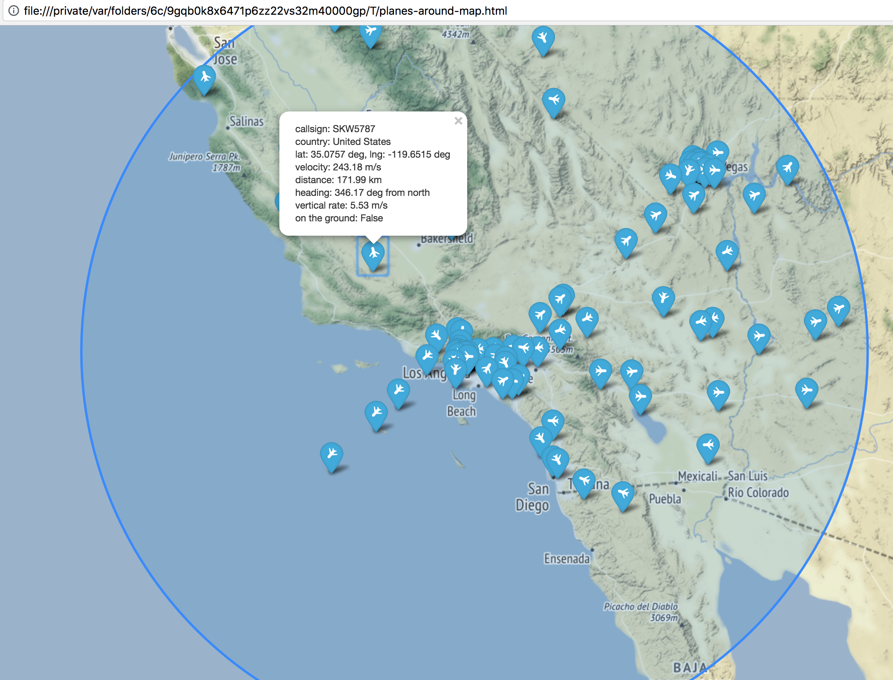

# Planes around

"Planes around" is a Python 3 utility that returns information about planes around the specified location.

By default, it tries to determine your location by IP address and looks for planes within a radius of 500 km.



## Installation

1. Install python 3
2. Install 'Planes around' using [pip](http://www.pip-installer.org/en/latest/) with:

```
pip install planes-around
```

Or, clone this repository to your local machine.

## Usage

```
planes_around
```

## Optional arguments:
```
usage: planes_around [-h] [--lat LAT] [--lng LNG] [-r RADIUS] [-n NAME]
                     [--heading HEADING] [--heading-delta HEADING_DELTA]
                     [--no-map] [--no-map-radius]
                     [--on-the-ground | --in-the-sky]

Get info about planes around the specified location using the OpenSky service.
By default, the program tries to determine your location by IP address and
looks for planes within a radius of 500 km.

optional arguments:
  -h, --help            show this help message and exit
  --lat LAT             Latitude in degrees
  --lng LNG             Longitude in degrees
  -r RADIUS, --radius RADIUS
                        Search planes within a radius (kilometers)
  -n NAME, --name NAME  The name of the city or place near which you want to
                        search
  --heading HEADING     Filter planes by their direction in degrees in respect
                        to the North clockwise
  --heading-delta HEADING_DELTA
                        Heading plus/minus a certain number of degrees
  --no-map              Don't show the map
  --no-map-radius       Don't display radius circle on the map
  --on-the-ground       Show only planes on the ground
  --in-the-sky          Show only planes in the sky
```

## Run tests

```
pytest
```

## Future features

* Draw aproximate trajectories
* Check if plane will flies over the area (point +/- delta)

